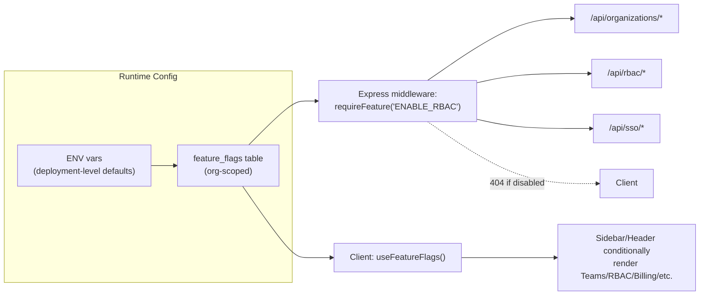
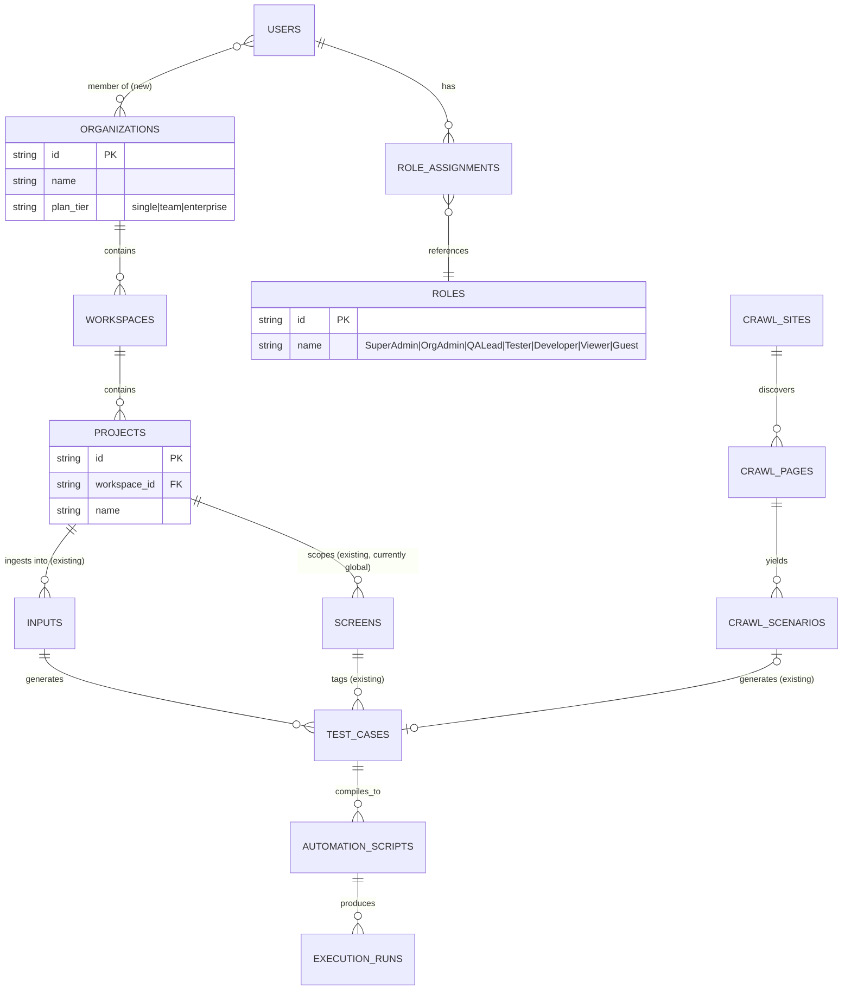
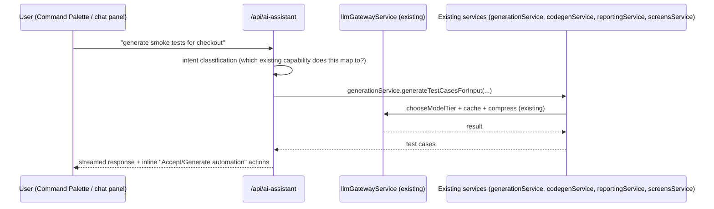

# Architecture — AI-Powered Test Automation Platform

**Scope of this document:** the target modular architecture for Single User / Team / Enterprise
editions from the SRS, mapped onto **this actual codebase** (Express + SQLite + React/Vite,
mock-by-default LLM gateway) rather than a from-scratch NestJS/Next.js/Prisma rewrite. Everything
under "Current" below exists and is verified working today; everything under "Target" is a
proposed extension of the same codebase, not a replacement of it. A companion visual reference
(key screens, navigation, dark/light mode) is published as a separate Figma-style artifact — see
the link shared alongside this document.

**Why this shape, not a rewrite:** the codebase already implements ~90% of the SRS's functional
requirements (see `GAP_ANALYSIS.md`) behind a single Express server and one React app. Introducing
NestJS/Next.js/Prisma/Postgres/Kubernetes today would mean re-implementing all of that from zero
before reaching feature parity. The lower-risk path is: keep the working core, and layer the
edition/RBAC/multi-tenancy concerns on top as new modules — which is exactly what "modular,
feature-based architecture where enterprise features extend the core platform rather than
replacing it" (the SRS's own instruction) means in practice.

---

## 1. Edition strategy

| Edition | Who | What's different |
|---|---|---|
| **Single User** (default) | Solo QA/automation engineer, freelancer | Everything visible today with `mode="single"`: no user switcher, no team/governance panels, no shared-runner-pool fields. This is the *default* running mode — see `client/src/context/AppState.tsx`'s `mode` state and `Header.tsx`'s Single QA / Enterprise switch. |
| **Team** | Small QA team sharing one instance | Adds: user-scoped views of shared projects, review/approval workflow (already partially built — `FR-2.4`, `FR-8.6` second-reviewer sign-off), comments, shared execution profiles (already exist), Slack/Teams/Jira/Azure/GitHub notifications (already exist for Slack/Teams/Jira/Azure — GitHub/GitLab/Bitbucket are new). |
| **Enterprise** | Multi-team org, compliance requirements | Adds: real multi-tenancy (`organizations` → `workspaces` → `projects`), full RBAC role hierarchy, SSO (SAML/OIDC — currently a stub, see `adminService.ts`'s `getSsoConfig`/`ssoCallback`), SCIM provisioning, secrets vault, audit/compliance exports, billing, dedicated runner pools. |

**Mechanism:** one codebase, one deployable. Edition is a **runtime configuration**, not a build
variant — this matches the SRS's "without changing the codebase" requirement.



---

## 2. Feature flag design

### 2.1 Storage

Extend the existing `org_settings` single-row pattern (already used for PII redaction and
cost-saving mode) into a proper multi-row **`feature_flags`** table, since Team/Enterprise
introduces more than one org:

```sql
CREATE TABLE feature_flags (
  id TEXT PRIMARY KEY,
  org_id TEXT NOT NULL DEFAULT 'default',   -- 'default' until multi-tenancy ships
  flag_key TEXT NOT NULL,                    -- e.g. 'ENABLE_RBAC'
  enabled INTEGER NOT NULL DEFAULT 0,
  updated_by TEXT,
  updated_at TEXT NOT NULL,
  UNIQUE(org_id, flag_key)
);
```

A deployment-level `.env` supplies **defaults** (`ENABLE_RBAC=false` for a Single-User deploy,
`true` for an Enterprise deploy) that seed this table on first boot; after that, flags are
DB-controlled so an admin can toggle them at runtime without a redeploy — same pattern already
proven by `org_settings.cost_saving_mode`.

### 2.2 Flag catalog

| Flag | Gates | Current status |
|---|---|---|
| `ENABLE_MULTIUSER` | User directory, user switcher, per-user notification prefs | ✅ exists today (`users` table, `X-User-Id` header) — just needs a real login/session in front of it |
| `ENABLE_RBAC` | Role-based route guards beyond the existing QA-Lead-only checks | 🟡 partial — `requireRole()` middleware exists; needs the full role hierarchy (Super Admin → Guest) |
| `ENABLE_TEAMS` | Shared projects, comments, assignments | ❌ new — projects aren't a first-class entity yet (inputs/screens are the closest existing unit) |
| `ENABLE_BILLING` | Subscription/usage-based billing UI | ❌ new |
| `ENABLE_SSO` | SAML/OIDC login | 🟡 stub exists (`getSsoConfig`/`ssoCallback`/`disableSsoUser`) — no real IdP handshake |
| `ENABLE_AUDIT` | Audit log UI/export beyond the existing table | ✅ backend exists (`audit_log` table, immutable, retention-stamped) — needs a full-featured UI |
| `ENABLE_ANALYTICS` | Cross-project analytics/insights | 🟡 partial — `Insights.tsx`/`reportingService.ts` exist per-instance, not per-org |
| `ENABLE_PRIVATE_RUNNERS` | Dedicated runner pool assignment | 🟡 stub — `runner_pool_name`/`reserved_runner_count` columns exist, no real pool |
| `ENABLE_ENTERPRISE_SECURITY` | Secrets vault, SCIM, IP allowlisting | 🟡 partial — `platform_secrets` (AES-256-GCM) exists; SCIM/vault/allowlisting are new |

### 2.3 Enforcement points (both layers, always)

- **Server**: `requireFeature(flagKey)` Express middleware (same shape as the existing
  `requireRole()` in `adminService.ts`) — returns `403 FEATURE_DISABLED` so a client can't route
  around a UI-only gate.
- **Client**: a `useFeatureFlags()` hook (mirrors the existing `mode` context pattern in
  `AppState.tsx`) drives conditional rendering in `Sidebar.tsx`, `Header.tsx`, and per-page panels
  — extending the gating already shipped for `mode === "enterprise"` in `Header.tsx`,
  `AiStudio.tsx`, `Settings.tsx`, and `Execution.tsx`.

This is a direct extension of work already merged this session (the Single-QA UI gating pass) —
`mode` becomes one of several flags rather than a special case.

---

## 3. Target folder structure (feature-based, additive)

The current tree is **not reorganized** — new capability areas are added as siblings, so nothing
that works today has to move:

```
server/src/
  routes/            # existing: inputs, testcases, codegen, execution, reporting,
                      #           integrations, admin, screens, environments, crawler, allure
  services/          # existing: one service per route, plus llmGatewayService (FR-9.x)

  # --- new, additive modules ---
  organizations/      # ENABLE_MULTIUSER+ : org CRUD, workspace CRUD
    routes.ts
    service.ts
  rbac/               # ENABLE_RBAC : role hierarchy, permission matrix
    routes.ts
    service.ts
    permissions.ts    # declarative Role -> [Action] map
  sso/                # ENABLE_SSO : real SAML/OIDC handshake (extends existing stub)
    saml.ts
    oidc.ts
    scim.ts
  billing/            # ENABLE_BILLING
    routes.ts
    service.ts
    providers/stripe.ts
  featureFlags/       # cross-cutting: flag storage + requireFeature() middleware
    service.ts
    middleware.ts
  projects/           # ENABLE_TEAMS+ : promotes "input batches" into first-class Projects
    routes.ts
    service.ts

client/src/
  pages/              # existing pages, unchanged
  pages/organizations/  # new, mounted only when ENABLE_MULTIUSER
  pages/billing/        # new, mounted only when ENABLE_BILLING
  hooks/useFeatureFlags.ts
  hooks/useRbac.ts
```

**Rule:** an Enterprise module may *read* core tables (test_cases, execution_runs, screens) but
core modules never import from an edition-gated module. This keeps Single User buildable and
runnable with the enterprise directories simply absent/empty.

---

## 4. Data model — current + planned



**Migration note:** `organizations`/`workspaces`/`projects`/`roles`/`role_assignments` are new
tables. Every existing table (`inputs`, `test_cases`, `screens`, `automation_scripts`,
`execution_runs`, `crawl_sites`, ...) gains a nullable `project_id` column, backfilled to a single
implicit "Default Project" — so Single User deployments never see the concept, and existing rows
don't need destructive migration.

---

## 5. API surface map

| Area | Base path | Status |
|---|---|---|
| Ingestion | `/api/inputs` | ✅ existing |
| Test cases | `/api/test-cases` | ✅ existing |
| Codegen | `/api/automation-scripts` | ✅ existing |
| Execution | `/api/execution-runs` | ✅ existing |
| Self-healing | `/api/self-healing` | ✅ existing |
| Reporting | `/api/reporting` | ✅ existing |
| Integrations | `/api/integrations` | ✅ existing (Jira/Azure/Slack/Teams/Git) |
| Screens | `/api/screens` | ✅ existing |
| Environments | `/api/environments` | ✅ existing |
| AI Crawler | `/api/crawler` | ✅ existing (this session) |
| Allure reporting | `/api/allure` | ✅ existing (this session) |
| Admin/governance | `/api/admin` | ✅ existing (RBAC-lite, audit, SSO stub, business rules) |
| **Organizations** | `/api/organizations` | ❌ planned |
| **RBAC** | `/api/rbac` | ❌ planned (extends `requireRole`) |
| **Billing** | `/api/billing` | ❌ planned |
| **Feature flags** | `/api/feature-flags` | ❌ planned |
| **AI Assistant (global chat)** | `/api/ai-assistant` | ❌ planned — see §6 |

Full request/response shapes for existing routes are inferable directly from
`client/src/api.ts` (already a de facto typed API contract) — a formal OpenAPI spec can be
generated from the existing Express routes + Zod/TS types as a follow-up, once the new routes'
shapes are agreed.

---

## 6. AI Assistant (global) — architecture note

The SRS asks for a global AI Assistant with prompts like "generate smoke tests," "explain this
failure," "show uncovered screens." Given the existing `llmGatewayService.ts` (semantic cache +
prompt compression + cost-aware routing already implemented), the assistant is a **thin
orchestration layer**, not a new AI stack:



Each example prompt in the SRS maps to a capability that **already exists** as a service function
— the assistant's job is intent routing + streaming the response, not reimplementing generation,
healing, or reporting logic a second time.

---

## 7. Phased roadmap

**Phase 1 — Single User (current state + polish)**
Already shipped this session: AI Crawler, Allure reporting fix, deletion cascade, single-QA UI
gating, cost-saving mode. Remaining: Screen Explorer UI polish, drag-and-drop upload, command
palette, dark mode.

**Phase 2 — Team**
`feature_flags` table + `requireFeature()` middleware → `projects` entity → review/approval UI →
GitHub/GitLab/Bitbucket integrations → shared execution profile visibility.

**Phase 3 — Enterprise**
`organizations`/`workspaces` + real RBAC role hierarchy → real SSO/SAML/SCIM → secrets vault →
billing → dedicated runner pools → audit/compliance export UI.

Each phase is additive per §3's folder-structure rule — no phase requires rewriting a prior
phase's code.

---

## 8. What this document deliberately does not do

- It does not propose swapping Express→NestJS, SQLite→Postgres, or React/Vite→Next.js. Those are
  legitimate choices *if* this needs to scale beyond a single-instance deployment (Postgres is the
  natural next step once `organizations` ships — SQLite's single-writer model is the real ceiling,
  not Express or React), but doing so now would mean re-earning the ~90% SRS coverage this
  codebase already has, for no functional gain yet.
- It does not fabricate Terraform/Kubernetes/CI-CD manifests for infrastructure that doesn't exist
  yet — those are meaningful once there's a multi-tenant, horizontally-scaled service to deploy;
  writing them speculatively against a single-process SQLite app would be decorative, not usable.

Both are natural Phase-2/3 follow-ups once `organizations`/`workspaces` land and there's a real
multi-tenant write pattern to design the datastore and deployment topology around.
