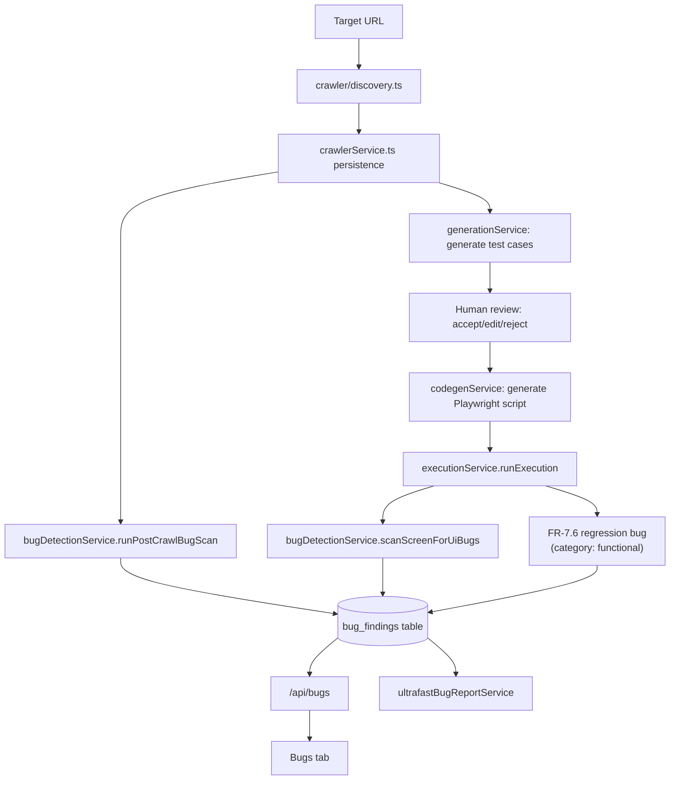

# Architecture Analysis — AI QA / Bug Discovery Engine Transformation

**Scope of this document:** a repository inspection and gap map for the "Autonomous AI QA / Bug
Discovery Engine" master prompt — i.e. turning this platform from "did the generated test pass?"
into "what can go wrong with this application?" This is a **different concern** from
`ARCHITECTURE.md` (which covers Single User → Team → Enterprise edition/multi-tenancy scaling) and
`GAP_ANALYSIS.md` (SRS v4.0 functional-requirement coverage). Nothing here proposes touching those.

This document does not modify code. It is the required first deliverable before any
implementation work begins, per the master prompt's own instruction ("do not generate code before
understanding the existing implementation").

---

## 1. Current architecture

**Stack:** Node.js/TypeScript + Express (`server/`), React 18 + Vite + Tailwind (`client/`),
SQLite via `better-sqlite3` (`server/src/db.ts`, one file, WAL mode), Playwright for both the
crawler and generated-test execution. Two npm workspaces, no separate build/deploy split — one
process serves the API, one dev server serves the SPA (proxied to it in dev).

**LLM layer:** `server/src/llm/` — a provider-abstraction (`types.ts`'s `LlmProvider` interface)
with two implementations: `mockProvider.ts` (deterministic, zero-API-key default, used for this
repo's own dev/test) and `anthropicProvider.ts` (real Claude calls, gated behind
`USE_MOCK_LLM=false` + `ANTHROPIC_API_KEY`). `llmGatewayService.ts` sits in front of both:
semantic caching, prompt compression, and cost-aware model-tier routing (`modelConfig.ts`).

**Everything is one Express app** (`server/src/index.ts`) mounting one router per concern under
`/api/*` (see §4). There is no microservice split, no message queue, no separate worker process —
execution runs are spawned as child processes (`execFile` on `npx playwright test`) from within
the same Express process.

---

## 2. Existing workflow / pipeline

Two pipelines exist today, and they already share infrastructure:

### 2.1 Ingest → Generate → Review → Codegen → Execute → Report (the SRS core pipeline)

```
Input (free text / screenshot / URL crawl / OpenAPI+Postman import / Jira+Azure import)
  → generationService.generateTestCasesForInput()   [LLM call via llmGatewayService]
  → human review (accept/edit/reject)                [testCaseFeatures.ts, routes/testcases.ts]
  → codegenService.generateAutomationScript()         [Playwright/Selenium/Cypress script + static security scan]
  → executionService.runExecution()                   [spawns `npx playwright test`, parses JSON reporter output]
  → reportingService (dashboard, flaky detection, coverage) + bugDetectionService (FR-7.6 regression filing)
```

### 2.2 AI Crawler pipeline (this session's earlier work, already merged)

```
URL → crawler/discovery.ts (BFS same-origin crawl, one authenticated browser context)
    → crawler/interaction.ts (exploratory clicks to surface dynamic elements)
    → crawler/locators.ts (accessibility-first locator ranking)
    → crawler/componentInventory.ts (page-composition summary: forms/tables/modals/pagination/...)
    → crawler/network.ts (XHR/fetch capture during the crawl, --capture-api flag)
    → crawler/scenarios.ts + apiScenarios.ts (turn discovered elements/APIs into scenario candidates)
    → crawler/scenarioDedup.ts (near-duplicate scenario collapsing)
    → crawler/diff.ts (Changed/Unchanged/New classification for re-crawls)
    → crawlerService.ts (persistence, orchestration, triggers bug scan post-crawl)
```

### 2.3 Deeper Bug Detection (this session's most recent work — the direct predecessor of the master prompt's ask)

Six capabilities were added on top of the existing crawl/execution flow, **not as a parallel
pipeline** — they hook into the same page visit `bugDetectionService.scanScreenForUiBugs()`
already used for post-crawl and post-execution scanning:

1. **Console/network capture** (`bugDetectionService.ts`) — `console.error`/`pageerror`/4xx/5xx,
   with a documented noise-suppression config (`BUG_SCAN_CONFIG`).
2. **API schema validation** (`apiSchemaService.ts`) — infers a JSON shape per endpoint from
   traffic, baseline-vs-strict mode, type-union/optional-field learning across samples to avoid
   false positives on legitimately-variable fields.
3. **Visual regression** (`screensService.ts`) — real `pixelmatch`/`pngjs` pixel diffing,
   animation-freezing before capture, per-screen ignore-selectors for dynamic regions.
4. **DOM-level checks** (`domChecksService.ts`) — zero-size-with-content, overlapping interactive
   elements, text-overflow/clipping (line-clamp aware), off-viewport elements.
5. **Responsive** (`responsiveService.ts`) — reruns checks 3-4 at configurable extra viewports
   (default mobile 390×844 + tablet 768×1024), correctly tags every finding type with `viewport`.
6. **UI-vs-API consistency** (`uiApiConsistencyService.ts`) — declarative rules comparing a
   rendered element count against a captured API response's count, with `exact`/`at-most`
   comparison modes (the latter to tolerate pagination/virtualization).

All six write into the same `bug_findings` table via `recordBugFinding()`, tagged with a
`category` field (`console-error | api-status | api-schema | ui-visual | ui-dom | ui-api-mismatch
| functional`). This taxonomy, and the pattern of "one shared table, every check writes into it
with a category," is the foundation the master prompt's bug-discovery engine should extend, not
replace.

---

## 3. Important files and modules

| Path | Role |
|---|---|
| `server/src/db.ts` | Entire SQLite schema, additive migrations via `ensureColumn()` |
| `server/src/index.ts` | Express app assembly, router mounting, demo-app static serving |
| `server/src/crawler/*` | Discovery, auth, network capture, locators, scenario generation, diffing, spellcheck, CLI |
| `server/src/services/crawlerService.ts` | Crawl orchestration/persistence, triggers post-crawl bug scan |
| `server/src/services/generationService.ts` | LLM-backed test case generation from any input type |
| `server/src/services/codegenService.ts` | Playwright/Selenium/Cypress script generation + static security scan |
| `server/src/services/executionService.ts` | Spawns/monitors `npx playwright test`, parses results, classifies failures, triggers bug scans |
| `server/src/services/bugDetectionService.ts` | **The core of the bug-discovery engine.** `scanScreenForUiBugs()` orchestrates console/network/DOM/visual/schema/consistency checks per page visit; `recordBugFinding()`/`listBugFindings()` are the single write/read path for all findings |
| `server/src/services/apiSchemaService.ts` | Phase 2 of Deeper Bug Detection — API contract inference/diffing |
| `server/src/services/domChecksService.ts` | Phase 4 — DOM-level UI checks |
| `server/src/services/screensService.ts` | Phase 3 — visual regression, screen cataloging |
| `server/src/services/responsiveService.ts` | Phase 5 — multi-viewport orchestration |
| `server/src/services/uiApiConsistencyService.ts` | Phase 6 — declarative UI/API count rules |
| `server/src/services/consoleErrorService.ts` | Console error parsing/categorization/severity (hand-rolled, no library) |
| `server/src/services/visualDetectionService.ts` | An older, cruder pixel-diff module (byte-buffer comparison), largely superseded by `screensService.ts`'s pixelmatch-based diffing but still used for some image-loading/text-rendering heuristics |
| `server/src/services/interactionValidationService.ts` | Validates recorded user interactions (click/input/navigate) against expectations |
| `server/src/services/integrationsService.ts` | Jira/Azure DevOps/Slack/Teams/Git — bug filing, notifications, retry-with-backoff |
| `server/src/services/reportingService.ts` | Dashboard, flaky-script detection, requirement/tag coverage, hours-saved |
| `server/src/services/adminService.ts` | RBAC-lite, audit log, org_settings getters/setters (the pattern every new threshold follows) |
| `server/src/routes/bugs.ts` | `/api/bugs` — findings CRUD, on-demand scan trigger, consistency-rule CRUD |
| `server/src/routes/apiSchemas.ts` | `/api/api-schemas` — schema review/edit/reset |
| `server/src/routes/admin.ts` | Every configurable threshold's GET/PUT (the config pattern to extend) |
| `server/tests/deeper-bug-detection.test.js` | Pure-logic tests for the six Deeper Bug Detection modules |
| `server/src/demo-app/*.html` | Hand-built fixture pages proving each check live against a real browser (not just asserted) |

---

## 4. Data flow (current)



**Key structural fact:** `bug_findings` is already the single sink every detection mechanism
writes into. There is currently **no correlation or deduplication layer between the writes and
the table** — six checks running against the same page visit produce up to six independent rows
even when they describe the same underlying defect (e.g. a failed payment API call, a stuck
spinner, and a console TypeError from the same user action are three separate rows today, not one
correlated bug). This is the single most important structural gap the master prompt's Phase 5
(correlation, dedup, confidence, root-cause reporting) needs to close.

---

## 5. Master-prompt capability map (what exists vs. what's net-new)

| # | Capability | Status | Evidence |
|---|---|---|---|
| 2 | Smart crawler / Application Map | 🟢 Mostly done | `discovery.ts`, `componentInventory.ts`, `NavEdge[]` graph. Missing: localStorage/cookie capture, iframe/shadow-DOM, Button→API edge granularity |
| 3 | Browser error monitoring | 🟢 Done | `bugDetectionService.ts` console/pageerror capture + `BUG_SCAN_CONFIG` |
| 4 | Network/API bug detection | 🟢 Mostly done | Status-code capture done; malformed-JSON/duplicate-request detection missing |
| 5 | API contract intelligence | 🟢 Done (self-inferred) | `apiSchemaService.ts`. OpenAPI-import-vs-live-traffic comparison missing (import exists only for test-gen ingestion) |
| 6 | UI bug detection | 🟢 Mostly done | `domChecksService.ts`. z-index/covered-element and "unclickable clickable" missing |
| 7 | Visual regression | 🟢 Done | `screensService.ts`. LLM visual-semantic reasoning layer missing |
| 8/9 | Negative testing / form validation intelligence | 🟡 Partial | LLM-prose generation exists and covers multi-angle scenarios; no deterministic field-type mutation engine or field-combination matrix |
| 10 | State transition testing | 🔴 Missing | No stateful flow builder, no refresh/back/duplicate-submit/session-expiry generator |
| 11 | Auth/authz testing | 🔴 Missing | Platform's own RBAC exists; nothing tests the *target app's* authz (IDOR, privilege escalation) |
| 12 | Accessibility testing | 🔴 Missing | No axe-core or equivalent anywhere in the repo |
| 13 | Responsive testing | 🟢 Done | `responsiveService.ts` |
| 14 | Performance testing | 🟡 Partial | Duration/cost tracked; no slow-API/slow-page threshold classification as a bug category |
| 15 | Broken resource detection | 🟢 Mostly done | Images/links checked; fonts/CSS/JS/favicon not |
| 16 | Exploratory AI agent | 🔴 Missing | Crawler does heuristic exploratory clicking, not an AI agent with history/budget/prioritization |
| 17 | UI/API correlation | 🔴 Missing | Every check writes an independent row; no event-correlation layer |
| 18 | Bug deduplication | 🔴 Missing | Scenario-level dedup exists (`scenarioDedup.ts`) for generated tests; no fingerprinting for bug findings |
| 19 | AI root cause analysis / structured report | 🟡 Partial | Rich `stepsToReproduce`/`evidence` per finding; no OBSERVED-FACT-vs-AI-INFERENCE distinction, no root-cause field |
| 20 | Bug confidence engine | 🔴 Missing | Severity exists; no numeric confidence, no signal-combination scoring |
| 21 | Flaky detection | 🟢 Done (execution-scoped) | `is_flaky`, `detectFlakyScripts`. Not yet applied to proactive bug-finding retry/confirmation |
| 22 | Evidence collection | 🟢 Mostly done | Screenshot/video/DOM state exist per finding; trace exists at run level, not attached per-finding |
| 23 | Reporting/dashboard | 🟡 Partial | Test-execution dashboard exists; no bug-category rollup (top failing pages/APIs, bugs by category) |
| 24 | Bug report format | 🟡 Partial | Close in substance, not in the exact template (missing Priority/Confidence/OS/Browser/explicit root-cause fields) |
| 25 | Configuration | 🟢 Strong | Every threshold added this session is DB-backed + API-editable, not hardcoded — this is already house style |

Legend: 🟢 done/mostly done · 🟡 partial · 🔴 missing/net-new.

---

## 6. Extension points

These are the places new capability should attach, given the existing architecture:

- **New finding types** → call `recordBugFinding()` with a new `category` value (extend the
  `BugCategory` union in `bugDetectionService.ts`), same as all six existing checks do. Security
  and accessibility findings should follow this exact pattern (`category: 'security'`,
  `category: 'accessibility'`), not a parallel table.
- **New checks that need the open page mid-scan** (axe-core injection, authz probes) → add a call
  inside `scanScreenForUiBugs()` alongside the existing DOM/visual/schema calls, following the
  same "pass the already-open `page`, don't re-navigate" discipline the six existing checks use.
- **New configurable thresholds** → `org_settings` column + `adminService.ts` getter/setter +
  `routes/admin.ts` GET/PUT, mirroring `visual_diff_threshold_percent`/`api_schema_default_mode`.
- **New per-screen suppression lists** (e.g. accessibility rules to ignore, authz routes excluded
  from testing) → `screens.<x>_ignore_json` column, following
  `visual_ignore_selectors_json`/`dom_check_ignore_selectors_json`.
- **Correlation/dedup/confidence (Phase 5)** → this is the one place that genuinely needs new
  architecture: a post-scan pass that reads the batch of `bug_findings` rows just written in one
  scan, groups them by shared signals (screen, run, time window, endpoint, error text), and either
  writes a new `bug_correlations` linking table or a `parent_finding_id` self-reference on
  `bug_findings` — see `IMPLEMENTATION_PLAN.md` for the concrete schema.
- **Exploratory agent (Phase 4)** → sits above `crawler/interaction.ts`, not inside it — a new
  service that consumes the Application Map + a bounded action budget and *decides* which
  discovered action to try next, calling into the existing interaction/execution primitives rather
  than reimplementing clicking/navigation.

---

## 7. Technical debt and risks

- **SQLite single-writer model.** Fine for the current single-instance deployment; a heavier
  exploratory agent generating many more findings per scan will increase write volume but not
  change the constraint qualitatively — no action needed now, flagged for awareness (this is the
  same ceiling `ARCHITECTURE.md` already identifies for the multi-tenancy roadmap).
- **No correlation layer means finding volume will look worse before it looks better.** Adding
  security/accessibility/state-transition checks on top of six existing ones, with no dedup,
  will multiply `bug_findings` rows for what's often one underlying defect. Phase 5 (dedup +
  correlation) should not be deferred to "later" the way a master-prompt phase list might imply —
  it should land no later than immediately after any new check that meaningfully increases finding
  volume, or the report becomes noisier, not more useful, exactly backwards from the master
  prompt's stated principle (§30: fewer false positives, minimal duplication).
- **`visualDetectionService.ts` duplication.** An older, cruder pixel-diff (byte-buffer RGBA
  comparison, no masking) coexists with `screensService.ts`'s newer, correct pixelmatch-based
  diffing. Not a blocker, but worth consolidating during Phase 2 work rather than building a third
  visual-diff path.
- **Sandbox/CI browser provisioning.** Not a repository defect — this development sandbox's
  installed Chromium build is version-mismatched with the pinned `playwright` package, which
  blocked direct browser launches until an `executablePath`/env-var override was added. Worth
  confirming the target CI/deployment environment doesn't have the same mismatch before relying
  on browser-heavy new checks (axe-core injection, authz page visits) running there unmodified.
- **No accessibility or security testing infrastructure exists at all.** These are the two
  heaviest net-new dependencies in the whole master prompt (`@axe-core/playwright` is a new
  runtime dependency; authz testing needs credentialed multi-user session handling that doesn't
  exist anywhere in the crawler today, which currently authenticates as one identity).

---

## 8. Recommended implementation approach

1. **Extend, never replace, `bugDetectionService.scanScreenForUiBugs()`.** It is already the
   single orchestration point for "one page visit, many checks, one shared output table." Every
   new check in Phases 2-4 of the master prompt's own phase plan (accessibility, security,
   performance, state-transition) should be a new function called from there, not a new pipeline.
2. **Config before code, everywhere.** Continue the `org_settings` + per-screen `_ignore_json`
   pattern already established for every existing threshold — new severity rules, exploration
   budgets, and ignored-route lists should be DB-backed and API-editable from day one, per the
   master prompt's own §25/§30.
3. **Build the correlation/dedup/confidence layer (master prompt Phase 5) early, not last.**
   Structurally it's the one piece that doesn't extend an existing module — everything else is
   "add a seventh/eighth/ninth check using the existing pattern." Sequencing it right after Phase 1
   (once there's real multi-check volume to correlate) avoids shipping four phases of
   finding-volume growth with no dedup, which directly contradicts the master prompt's own
   "optimize for fewer false positives, not more test cases" instruction.
4. **New heavy dependencies (axe-core, any authz-testing helper) go in `server/package.json`
   exactly like `pixelmatch`/`pngjs` did** — no separate service process, no new deployment
   topology.
5. **Deterministic rules first, LLM second, per check** — continue the pattern already proven in
   `consoleErrorService.ts` (hand-rolled severity/category rules) and `apiSchemaService.ts`
   (hand-rolled shape inference) rather than routing every classification through an LLM call.
   Reserve LLM calls for what's genuinely semantic: exploratory next-action selection, root-cause
   narrative generation, and (optionally) visual-diff reasoning — matching the master prompt's own
   §26 instruction.

See `IMPLEMENTATION_PLAN.md` for the phase-by-phase task breakdown, schema changes, and
sequencing this approach implies.
